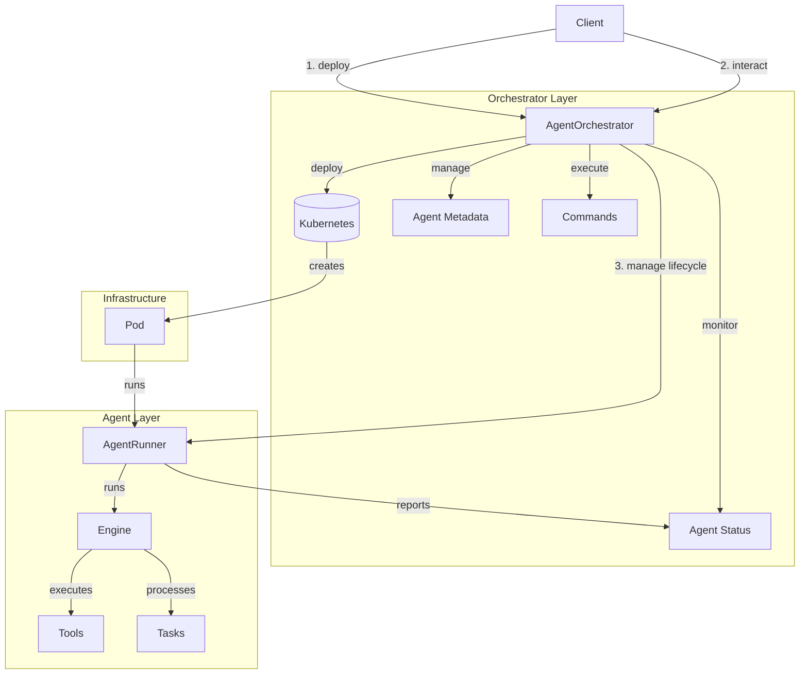

# Agentic Framework 

[](https://www.python.org/downloads/)
[](https://codecov.io/gh/zbytealchemy/ffc)
[](https://github.com/zbytealchemy/ffc/blob/main/LICENSE)
[](https://ffc.readthedocs.io/en/latest/?badge=latest)
[](https://github.com/zbytealchemy/ffc/actions/workflows/python.yml)
[](https://github.com/astral-sh/ruff)
[](https://python-poetry.org/)
[](https://github.com/zbytealchemy/ffc/blob/main/CONTRIBUTING.md)

This directory contains the Python implementation of the FFC Framework runtime.

📚 **Documentation**: [https://ffc.readthedocs.io/en/latest/](https://ffc.readthedocs.io/en/latest/)

## Architecture

The FFC Framework consists of two main layers: the Orchestrator Layer and the Agent Layer.



### Orchestrator (`AgentOrchestrator`)

The Orchestrator manages the lifecycle of agents and their resources. It handles:

- **Agent Deployment**: Creates Kubernetes deployments and services
- **Resource Management**: Manages compute resources and scaling
- **Command Execution**: Routes commands to appropriate agents
- **Status Monitoring**: Tracks agent health and status
- **Hierarchy Management**: Maintains parent-child relationships

Key operations:
```python
deploy_agent()      # Creates K8s deployment & service
terminate_agent()   # Cleans up resources
execute_command()   # Sends commands to agents
get_agent_status()  # Monitors agent health
get_agent_tree()    # Tracks agent hierarchy
```

### Agent Runner (`AgentRunner`)

The Agent Runner executes the agent's logic and manages its lifecycle. Components:

- **Engine**: Core execution engine for processing tasks
- **Tools**: Task-specific implementations (e.g., FileReader, FileWriter)
- **State**: Agent's current state and configuration
- **Tasks**: Queue of tasks to be processed

Key operations:
```python
start()            # Initializes and starts the agent
stop()             # Gracefully terminates
execute_command()  # Runs agent commands
process_tasks()    # Handles agent tasks
```

### Operational Flows

1. **Deployment Flow**:
```
Client -> Orchestrator -> Kubernetes -> Pod -> AgentRunner
```

2. **Command Execution Flow**:
```
Client -> Orchestrator -> Service Discovery -> Agent Endpoint -> AgentRunner -> Tool
```

3. **Status Monitoring Flow**:
```
Orchestrator -> Kubernetes API -> Pod Status
              -> Agent API -> Agent Health
```

4. **Parent-Child Relationship**:
```
Parent Agent -> Orchestrator -> Deploy Child -> Manage Hierarchy
```

### Key Features

1. **Scalability**: Kubernetes handles scaling and resource management
2. **Isolation**: Each agent runs in its own pod
3. **Hierarchy**: Supports parent-child agent relationships
4. **State Management**: Tracks agent status and metadata
5. **Tool Extensibility**: Custom tools can be added to agents

## Components

- `ffc/core/`: Core runtime components
  - `engine.py`: Agent runtime engine implementation
  - `orchestrator.py`: Agent orchestration and lifecycle management
  - `runner.py`: Agent execution and tool management
  - `tools.py`: Base tool implementation and utilities
  - `types.py`: Common type definitions

## Development

Use make targets for development:
```bash
make install      # Install dependencies
make format      # Format code
make lint        # Run linters
make test        # Run tests
make clean       # Clean up
```

## Docker

Docker-related commands:
```bash
make docker-build  # Build Docker image
make docker-run    # Run Docker container
make docker-push   # Push Docker image
