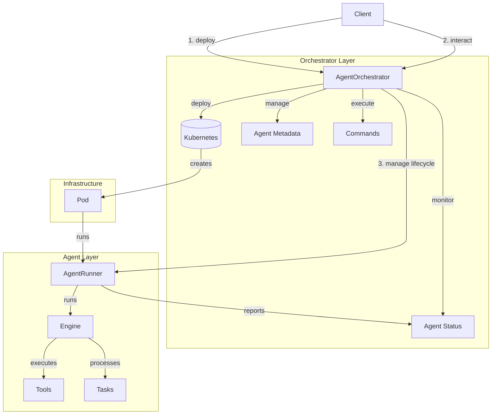

# Architecture Overview

The Firefly Catcher Framework (FFC) is built on a modular, scalable architecture designed for AI agent orchestration and execution. Here's a comprehensive overview of the system's key components.

## System Architecture

The FFC Framework consists of two main layers: the Orchestrator Layer and the Agent Layer, working together to provide a robust agent execution environment.



## Core Components

### 1. Orchestrator Layer (`AgentOrchestrator`)

The Orchestrator manages the complete lifecycle of agents and their resources:

#### Key Responsibilities
- **Agent Deployment**: Creates and manages Kubernetes deployments and services
- **Resource Management**: Handles compute resources and scaling
- **Command Execution**: Routes commands to appropriate agents
- **Status Monitoring**: Tracks agent health and status
- **Hierarchy Management**: Maintains parent-child relationships

#### Key Operations
```python
deploy_agent()      # Creates K8s deployment & service
terminate_agent()   # Cleans up resources
execute_command()   # Sends commands to agents
get_agent_status()  # Monitors agent health
get_agent_tree()    # Tracks agent hierarchy
```

### 2. Agent Layer (`AgentRunner`)

The Agent Runner executes the agent's logic and manages its lifecycle:

#### Components
- **Engine**: Core execution engine for processing tasks
- **Tools**: Task-specific implementations (e.g., FileReader, FileWriter)
- **State**: Agent's current state and configuration
- **Tasks**: Queue of tasks to be processed

#### Key Operations
```python
start()            # Initializes and starts the agent
stop()             # Gracefully terminates
execute_command()  # Runs agent commands
process_tasks()    # Handles agent tasks
```

### 3. LLM Integration
The LLM system provides:
- Flexible provider interface for multiple LLM services
- Template management for prompts
- Context handling and token management
- Error handling and fallback strategies

### 4. Tool System
The tool system enables:
- Custom tool creation and registration
- Permission-based tool access
- Standardized tool execution interface
- Resource usage tracking

## Operational Flows

### 1. Deployment Flow
```
Client -> Orchestrator -> Kubernetes -> Pod -> AgentRunner
```

### 2. Command Execution Flow
```
Client -> Orchestrator -> Service Discovery -> Agent Endpoint -> AgentRunner -> Tool
```

### 3. Status Monitoring Flow
```
Orchestrator -> Kubernetes API -> Pod Status
              -> Agent API -> Agent Health
```

### 4. Parent-Child Relationship Flow
```
Parent Agent -> Orchestrator -> Deploy Child -> Manage Hierarchy
```

## Key Features

1. **Scalability**:
   - Kubernetes-based orchestration
   - Dynamic resource allocation
   - Horizontal scaling capabilities

2. **Isolation**:
   - Each agent runs in its own pod
   - Resource limits per agent
   - Secure inter-agent communication

3. **Hierarchy**:
   - Parent-child agent relationships
   - Inheritance of permissions
   - Coordinated lifecycle management

4. **State Management**:
   - Agent status tracking
   - Metadata persistence
   - Resource state monitoring

5. **Tool Extensibility**:
   - Custom tool development
   - Plugin architecture
   - Permission-based access control

## Security Model

The framework implements a comprehensive security model:
- Permission-based access control for tools and resources
- Sandboxed execution environment
- Resource limits and monitoring
- Secure communication between agents

## Resource Management

Resource management is handled at multiple levels:
- Container-level resource limits (CPU, memory)
- Tool-level resource tracking
- LLM token usage monitoring
- Timeout handling for long-running operations
