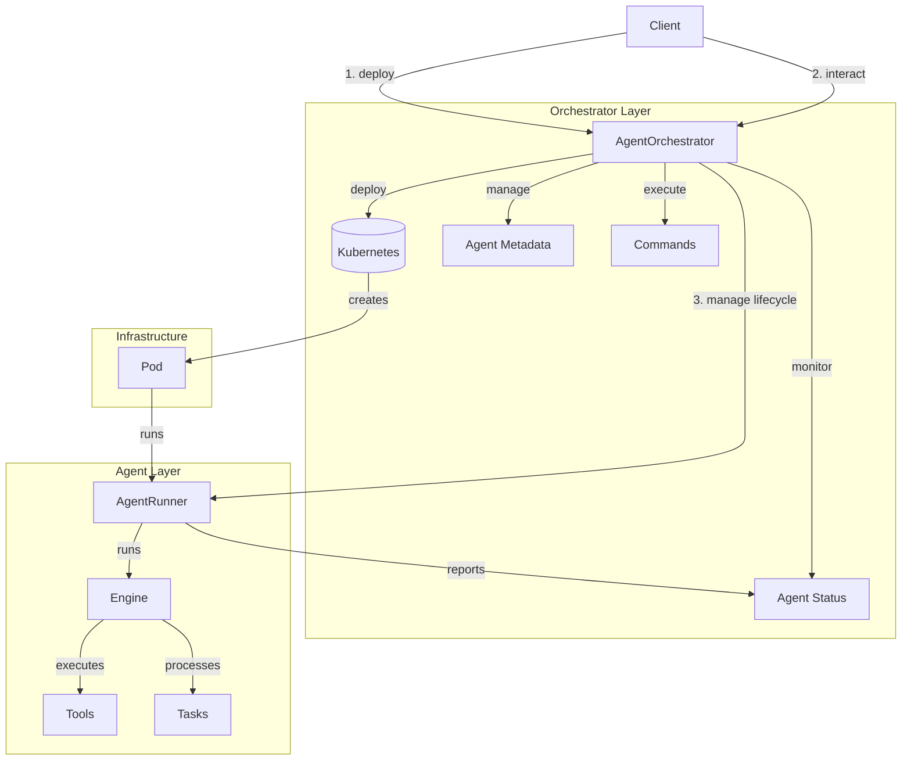

# Agent Orchestration Guide

This guide covers the agent orchestration system in the Firefly Catcher Framework, which enables the creation and management of distributed AI agents.

## Overview

The FFC Agent Orchestration system provides:
- Distributed agent deployment and management using Kubernetes
- Parent-child agent relationships with inheritance
- Resource management and monitoring
- Permission inheritance and enforcement
- Inter-agent communication and coordination

## Architecture

The orchestration system consists of two main components:



## Components

### Agent Runner

The `AgentRunner` is responsible for executing individual agents:

```python
from ffc.agent import AgentRunner
from pathlib import Path

# Create runner from specification file
runner = await AgentRunner.from_file(Path("agent_spec.json"))

# Start the agent
await runner.start()

# Execute commands
result = await runner.execute_command("analyze_data")

# Stop the agent
await runner.stop()
```

### Agent Orchestrator

The `AgentOrchestrator` manages the lifecycle of distributed agents:

```python
from ffc.core.orchestrator import AgentOrchestrator

# Initialize orchestrator
orchestrator = AgentOrchestrator(
    namespace="ffc-agents",
    agent_image="ffc-agent-runtime:latest"
)

# Deploy a new agent
agent_id = await orchestrator.deploy_agent(spec)

# Get agent status
status = await orchestrator.get_agent_status(agent_id)

# Execute command on agent
result = await orchestrator.execute_command(agent_id, "analyze_data")

# Terminate agent
await orchestrator.terminate_agent(agent_id)
```

## Agent Lifecycle

### States
- `PENDING`: Agent is being initialized
- `RUNNING`: Agent is actively executing
- `FAILED`: Agent encountered an error
- `TERMINATED`: Agent has been stopped
- `PAUSED`: Agent execution is paused

### Lifecycle Management
```python
# Pause agent
await orchestrator.pause_agent(agent_id)

# Resume agent
await orchestrator.resume_agent(agent_id)

# Scale agent resources
await orchestrator.scale_agent(agent_id, new_resources)

# Get agent tree
tree = await orchestrator.get_agent_tree(agent_id)
```

## Parent-Child Relationships

### Creating Child Agents
```python
# Parent agent creates child
child_spec = {
    "name": "data-processor",
    "tools": ["process_data", "store_results"],
    "permissions": inherited_permissions
}

child_id = await runner.execute_command("create_agent", spec=child_spec)
```

### Managing Relationships
```python
# Get child agents
children = await orchestrator.get_children(agent_id)

# Get parent agent
parent = await orchestrator.get_parent(agent_id)

# Terminate all children
await orchestrator.terminate_children(agent_id)

# Get full agent hierarchy
hierarchy = await orchestrator.get_agent_tree(root_id)
```

## Resource Management

### Setting Limits
```python
from ffc.core.schema import ResourceLimits

limits = ResourceLimits(
    cpu="1",
    memory="1Gi",
    storage="5Gi"
)

await orchestrator.deploy_agent(spec, resource_limits=limits)
```

### Monitoring Usage
```python
# Get agent resource usage
usage = await orchestrator.get_resource_usage(agent_id)

# Get cluster-wide usage
cluster_usage = await orchestrator.get_cluster_usage()

# Get agent metrics
metrics = await orchestrator.get_agent_metrics(agent_id)
```

## Permission Management

### Defining Permissions
```python
from ffc.core.schema import Permission

permissions = [
    Permission(resource="data/*", actions=["read"]),
    Permission(resource="results/*", actions=["write"])
]

spec["permissions"] = permissions
```

### Inheritance
```python
# Child inherits subset of parent permissions
child_permissions = await orchestrator.get_inherited_permissions(
    parent_id,
    requested_permissions
)

# Check permission
has_permission = await orchestrator.check_permission(agent_id, permission)
```

## Communication

### Inter-agent Communication
```python
# Send message to another agent
await runner.send_message(target_id, message)

# Receive messages
messages = await runner.get_messages()

# Subscribe to agent events
await runner.subscribe_to_events(event_types=["status_change", "error"])
```

### Broadcasting
```python
# Broadcast to all children
await orchestrator.broadcast_to_children(agent_id, message)

# Broadcast to specific agents
await orchestrator.broadcast_to_agents(agent_ids, message)
```

## Error Handling

### Agent Errors
```python
try:
    await orchestrator.deploy_agent(spec)
except AgentDeploymentError as e:
    # Handle deployment failure
    logger.error(f"Deployment failed: {e}")
    # Attempt recovery
    await orchestrator.cleanup_failed_deployment(agent_id)
```

### Resource Errors
```python
try:
    await orchestrator.scale_agent(agent_id, new_resources)
except ResourceLimitError as e:
    # Handle resource limit exceeded
    logger.error(f"Scaling failed: {e}")
    # Fall back to default resources
    await orchestrator.reset_agent_resources(agent_id)
```

## Best Practices

1. **Resource Management**
   - Set appropriate resource limits based on agent workload
   - Implement resource monitoring and alerts
   - Use auto-scaling for dynamic workloads
   - Clean up resources after agent termination

2. **Permission Control**
   - Follow principle of least privilege
   - Regularly audit permission inheritance
   - Implement permission checks in critical operations
   - Document permission requirements

3. **Error Handling**
   - Implement proper error recovery mechanisms
   - Use exponential backoff for retries
   - Log all failures with context
   - Monitor agent health metrics

4. **Scaling**
   - Use appropriate namespace isolation
   - Implement proper cleanup procedures
   - Monitor cluster capacity
   - Consider resource quotas

5. **Communication**
   - Use asynchronous communication when possible
   - Implement timeout mechanisms
   - Handle message delivery failures
   - Monitor communication patterns

6. **Monitoring**
   - Track agent metrics and health
   - Monitor resource usage trends
   - Set up alerts for critical conditions
   - Maintain audit logs
